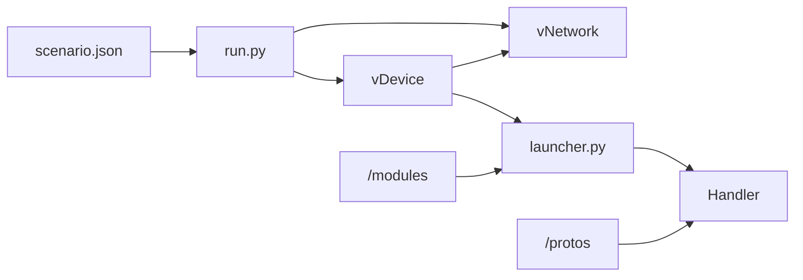

# Network Emulation Framework for Industrial Control Systems (NEFICS)

NEFICS aims to provide researchers with a flexible way to simulate high-fidelity devices for industrial control systems.

## Quickstart

Based on Mininet, NEFICS instantiates whichever devices the user specifies within the configuration file used at runtime:

> `python3 -m run conf/simple_powergrid.json`

## NEFICS runtime



With a configuration file, NEFICS will create a virtual network and instantiate any defined devices in which the launcher component will run. NEFICS will run every launcher component with the corresponding settings for it to import the designated module and instantiate a handler for the emulated device.

The handler creates an instance of the emulated device, which will hold the virtual memory mapping of the device and the logic implemented in the chosen module. It will also instantiate listeners for every configured protocol and associate the corresponding mappings to the emulated device, allowing any incoming connections to interact with the emulated memory. The Handler will also take care of terminating the device and the listeners upon receiving a KILL or TERM signal.

Even though we designed NEFICS to emulate complete networks, you can also emulate a single device by running the launcher directly, providing the necessary configuration either via a configuration file or as a string in the command line:

* Using a configuration file: 

```bash
python3 -m nefics.launcher -c config_file.json
```

* Using a string:

```bash
python3 -m nefics.launcher -C '{"module":"simplepowergrid","device":"Source","handler":"RTUHandler","guid":1,"in":[],"out":[2],"parameters":{"voltage": 526315.79}}'
```

## Sample configuration

The configuration file is in JSON format and specifies the network topology of the simulation, detailing the switches and devices that Mininet will instantiate. A device configuration directive contains its name and DPID. On the other hand, each device has an identifier, network interfaces associated with any corresponding switches, a launcher configuration that determines the process to run within the device, and the network routes.

*conf/simple_powergrid.json:*

```json
{
    "switches": [
        { "name": "s1", "dpid": 1 }
    ],
    "devices": [
        {
            "name": "hsrc",
            "interfaces": [
                {"name": "eth0", "mac": "68:1f:d8:9a:78:1c", "ip": "10.0.1.11/24", "switch": "s1"}
            ],
            "launcher": {
                "module": "simplepowergrid",
                "device": "Source",
                "handler": "RTUHandler",
                "guid": 1, "in": [], "out": [2],
                "parameters": {
                    "voltage": 526315.79
                }
            },
            "routes": [ ["default", "10.0.1.1"] ]
        },
        {
            "name": "htx",
            "interfaces": [
                {"name": "eth0", "mac": "68:1f:d8:76:ac:09", "ip": "10.0.1.12/24", "switch": "s1"}
            ],
            "launcher": {
                "module": "simplepowergrid",
                "device": "Transmission",
                "handler": "RTUHandler",
                "guid": 2, "in": [1], "out": [3],
                "parameters": {
                    "loads": [0.394737, 0.394737, 0.394737],
                    "state": 7
                }
            },
            "routes": [ ["default", "10.0.1.1"] ]
        },
        {
            "name": "hld",
            "interfaces": [
                {"name": "eth0", "mac": "68:1f:d8:bb:a3:f1", "ip": "10.0.1.13/24", "switch": "s1"}
            ],
            "launcher": {
                "module": "simplepowergrid",
                "device": "Load",
                "handler": "RTUHandler",
                "guid": 3, "in": [2], "out": [],
                "parameters": {
                    "load": 12.5
                }
            },
            "routes": [ ["default", "10.0.1.1"] ]
        }
    ]
}
```

## Acknowledgments
This research was possible thanks to the federal grants NIST 70NANB17H282 and DHS/AFRL FA8750-19-2-0010.
